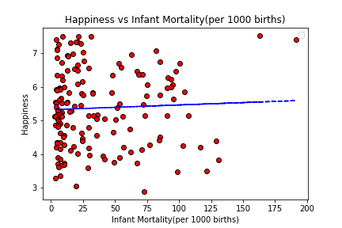
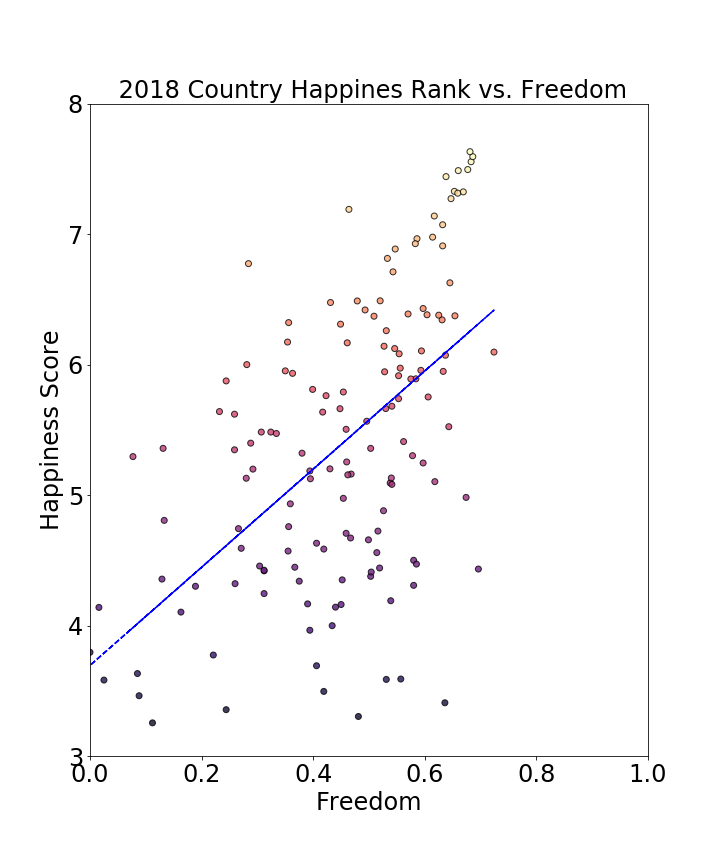

### World Happiness Study
### You can find our git repo at: 
[World Happiness Study](https://github.com/setholindaman/World-Happiness-Study)

## Goal:
Determine if there is a coorelation between overal happiness and several quality of life indicators.

## Inspiration:
Forbes magazine article ranking [The 10 Happiest Countries in the World 2019](https://www.forbes.com/sites/duncanmadden/2019/03/28/ranked-the-10-happiest-countries-in-the-world-in-2019/#18b8208748a5)

##  Data: 
*   World Bank API
*   [World Happiness Report](https://www.kaggle.com/unsdsn/world-happiness) 2016-2018

## Output
* Power Point Presentation 
* Happiness Bubble Chart 
* 
* 
* 
* 

## Team members:

* Seth Lindaman
* Mona Arami
* Mendie Elit
* Ryan Kulpack
* Dawn Roedel

  